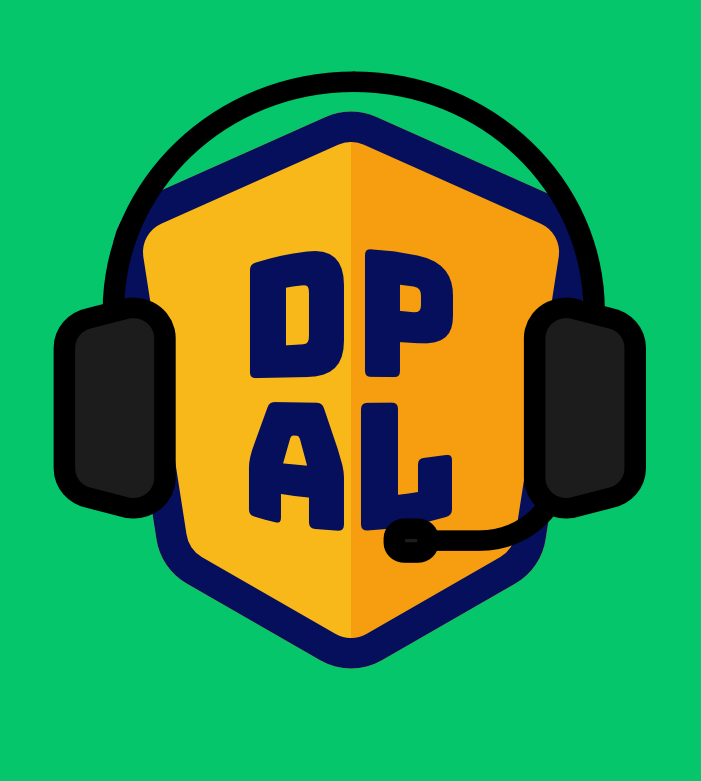
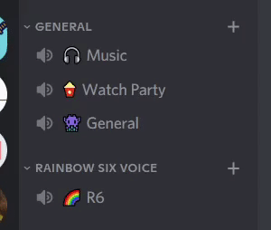
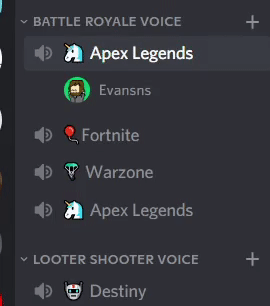

Voice Chat Bot
===

What is it?
---

DPAL Voice bot is an automated way to manager the empty channels in your server.

DPAL Voice Bot will ensure that your server will always have an empty channel for a new group of players to join!

Voice bot creates a duplicate of the current channel whenever the first person joins. And then deletes any channel after the last person leaves!

The duplicate channel will be copied into the same category. This does mean that the order if your channels can change

How do I get it?
---
Simply click [this link](https://discord.com/api/oauth2/authorize?client_id=856681398014443562&permissions=8&scope=bot)!

Note: you must be an admin of the server to add it

